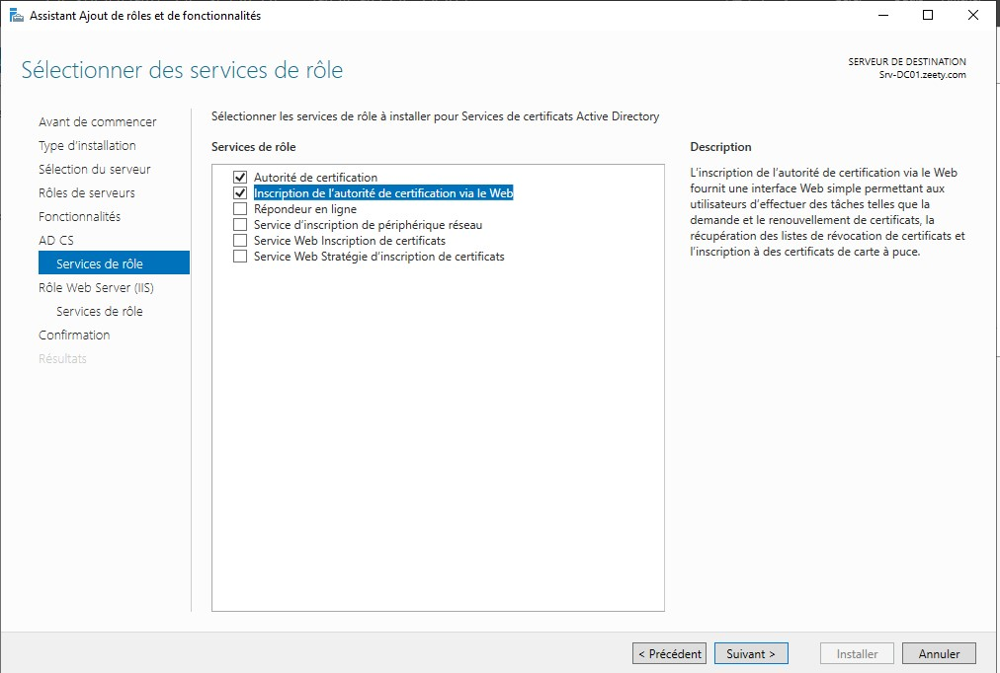
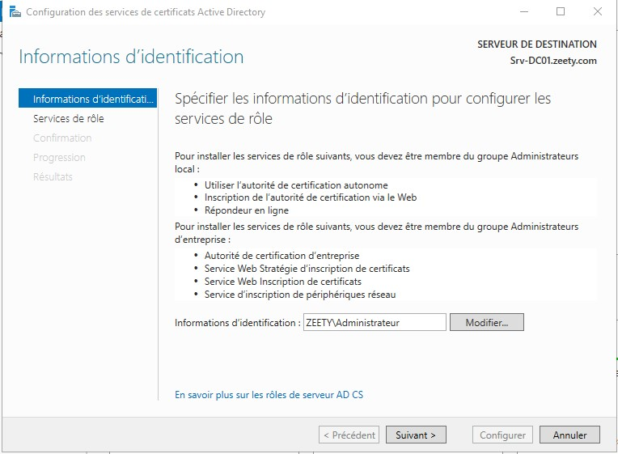
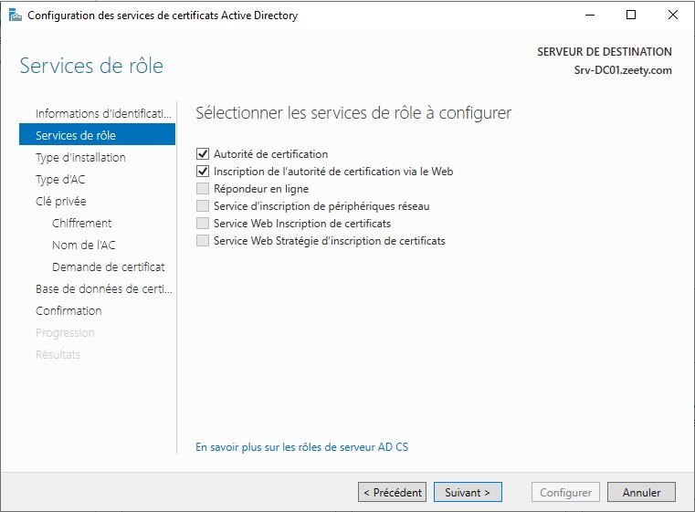
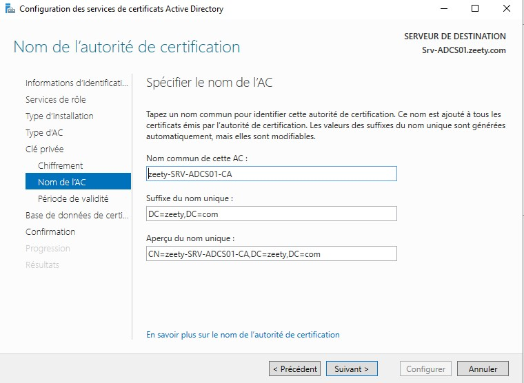
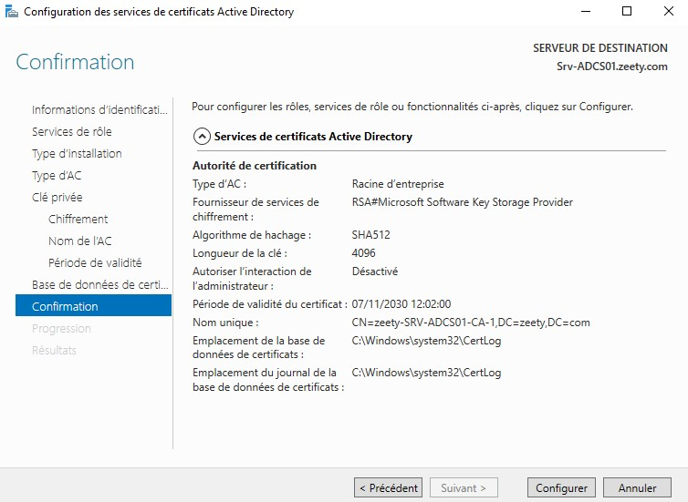

# Zeety – Déploiement d’une infrastructure client/serveur sécurisée
_Document technique_

## 1. Introduction

Dans le cadre de l’évolution de l’infrastructure informatique de l’agence web Zeety, il a été décidé de mettre en place une architecture client/serveur centralisée et sécurisée.
L’objectif de cette infrastructure est de faciliter la gestion du réseau, de centraliser les comptes utilisateurs, de sécuriser les données et de garantir une administration efficace grâce à des services de base tels que Active Directory (AD DS), DNS, DHCP et ADCS.

Cette infrastructure repose sur un environnement virtualisé (VirtualBox) et comprend les équipements suivants :

Un pare-feu PfSense pour la gestion du routage et de la sécurité du réseau.

Deux serveurs Windows Server 2019 :

Srv-DC01 : serveur principal hébergeant les rôles AD DS, DNS et DHCP.

Srv-ADCS01 : serveur d’autorité de certification (ADCS).

Un poste client Windows 10, intégré au domaine et configuré pour recevoir son adresse IP via DHCP.

## 2. Configuration du serveur Srv-DC01
### 2.1. Rôles installés

AD DS (Active Directory Domain Services) : gestion du domaine, des utilisateurs et des groupes.

DNS (Domain Name System) : résolution des noms internes au domaine.

DHCP (Dynamic Host Configuration Protocol) : attribution automatique des adresses IP aux postes clients.

### 2.2. Configuration du domaine

Changer le nom du serveur : **Srv-DC01**

Configurer une IP fixe :

Adresse IP : **192.168.10.1**

Masque : **255.255.255.0**

Passerelle : **192.168.10.254**

DNS préféré : **127.0.0.1**

Installer le rôle AD DS via le gestionnaire de serveur.

Promouvoir le serveur en contrôleur de domaine :

Nouveau domaine : **zeety.com**

Niveau fonctionnel : **Windows Server 2016/2019**

Créer la forêt zeety.com

Redémarrer le serveur.

### 2.3. Installation et configuration du rôle DNS

Le rôle DNS est installé automatiquement avec AD DS.

Vérifier la présence d’une zone de recherche directe zeety.com.

Ajouter la zone de recherche inversée :

Réseau : **192.168.10.0**

Zone : **10.168.192.in-addr.arpa**

Vérifier la bonne résolution du nom srv-dc01.zeety.com.

### 2.4. Installation et configuration du rôle DHCP

Installer le rôle DHCP Server via le gestionnaire de serveur.

Autoriser le serveur DHCP dans l’AD.

Créer les étendues DHCP pour chaque VLAN.

Activer les baux et vérifier qu’un poste client Windows 10 reçoit une IP du bon VLAN via le relai DHCP configuré sur PfSense.

## 3. Configuration du serveur Srv-ADCS01
### 3.1. Rôle installé

ADCS (Active Directory Certificate Services) : création d’une autorité de certification racine interne pour sécuriser les échanges (HTTPS, authentifications, signatures, etc.).

### 3.2. Configuration réseau

Nom du serveur : **Srv-ADCS01**

Adresse IP : **192.168.10.2**

Passerelle : **192.168.10.254**

DNS : **192.168.10.1**

### 3.3. Installation du rôle ADCS

Depuis le Gestionnaire de serveur, ajouter le rôle Services de certificats Active Directory.

 

Sélectionner :

Autorité de certification

Inscription de certificats Web (CertSrv)

Installer le rôle.

### 3.4. Configuration de l’autorité de certification

Pour configurer le rôle, il faut sélectionner les informations d’identification. Il est important de choisir un compte administrateur du domaine,
dans ce cas : **ZEETY\Administrateur**.    

Sélectionner les services de rôle suivant pour configuration :
- Autorité de certification    
- Inscription de l'autorité de certification via le Web    

Ajouter une nouvelle forêt et renseigner le nom du domaine : **zeety.com**

Choisir Autorité de certification d’entreprise.

Choisir Racine (autorité racine interne).

Créer une nouvelle clé privée RSA 4096 bits, hachage SHA512.

Nom commun : zeet-SRVV-ADCS01-CA

Validité : 5 ans.

Terminer l’installation et démarrer le service.

### 3.5. Configuration de l’interface web CertSrv

Ouvrir l’URL : _http://srv-adcs01/certsrv_

Vérifier l’accès depuis le domaine zeety.com.

Exporter le certificat racine depuis la console de l’autorité de certification et le copier sur Srv-DC01.

### 3.6. Création d’un modèle de certificat SSL

Ouvrir la console certsrv.msc.

Dupliquer le modèle Web Server.

Nommer le modèle : **Zeety-WebServer**

Autoriser l’inscription au groupe Domain Admins.

Publier le modèle.
### 3.7. Demande de certificat pour Srv-DC01

Depuis Srv-DC01, ouvrir MMC > Certificats (ordinateur local).

Nouvelle demande de certificat → modèle Zeety-WebServer.

Valider la demande.

Le certificat est automatiquement signé par la CA Zeety-RootCA.

### 3.8. GPO d’inscription automatique des certificats

Ouvrir GPMC.msc sur Srv-DC01.

Créer une GPO : AutoEnrollmentCerts.

Modifier la stratégie :

Configuration ordinateur > Paramètres Windows > Paramètres de sécurité > Stratégies de clé publique >
Activer « Inscription automatique des certificats ».

Lier la GPO au domaine zeety.com.

## 4. Exemple de création d’Unités d’organisation, groupes et utilisateurs
### 4.1. Arborescence Active Directory

**UO_Infographistes**

Groupe : **GR_Infographistes**

Utilisateurs : **Harry COVERRE, Jacques SEDE**

**UO_Commerciaux**

Groupe : **GR_Commerciaux**

Utilisateurs : **Alain PROVIST, Alex EPTION, Emilie TERT**

**UO_Comptabilité**

Groupe : **GR_Comptabilité**

Utilisateurs : **Dina MIKKE, Eli MINET**

### 4.2. Exemple de création (à répéter pour chaque unité)

Ouvrir Utilisateurs et ordinateurs Active Directory.

Clic droit sur le domaine zeety.com → Nouveau → Unité d’organisation → Nommer : UO_Infographistes.

À l’intérieur, clic droit → Nouveau → Groupe → Nommer : GR_Infographistes.

Ajouter l’utilisateur :

Nouveau → Utilisateur → Jacques SEDE.

Définir le mot de passe et l’ajouter au groupe GR_Infographistes.

## 5. Sécurisation de l’infrastructure

PfSense agit comme pare-feu entre les VLANs et contrôle les flux inter-réseaux.

Les serveurs ont des IP fixes et sont isolés dans un VLAN spécifique (VLAN 10).

Le serveur ADCS est dédié uniquement à la certification et n’héberge aucun autre service.

Le domaine zeety.com centralise l’authentification et les autorisations.

L’accès à l’interface web CertSrv est limité aux administrateurs de domaine.
